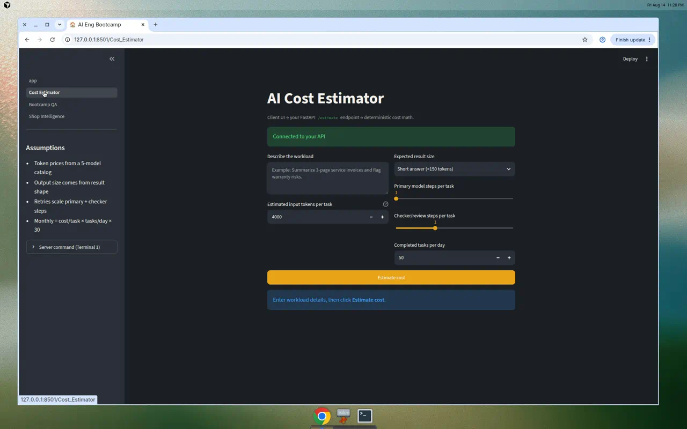
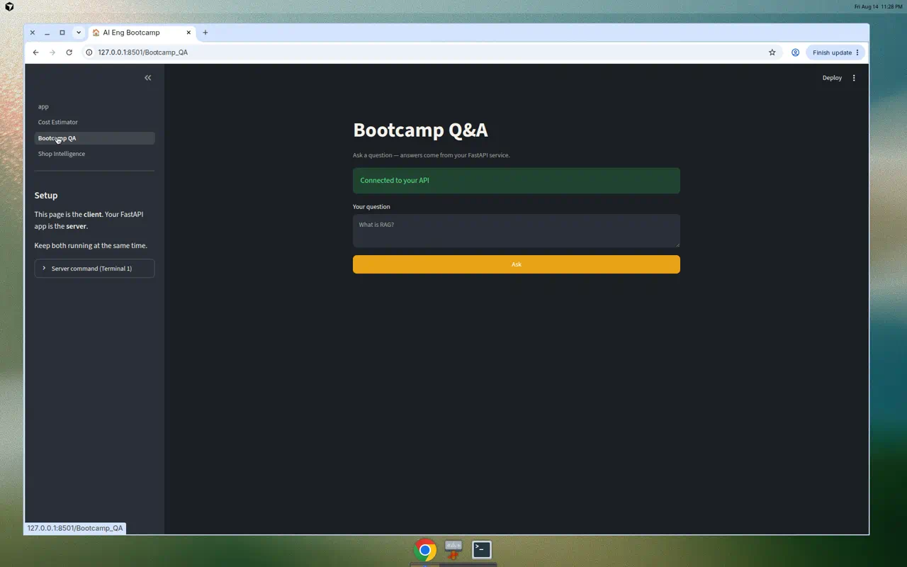
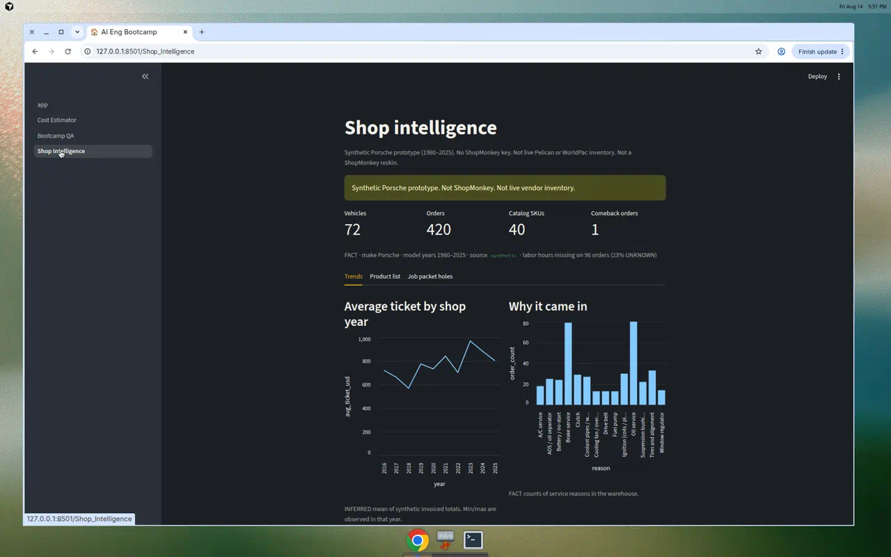
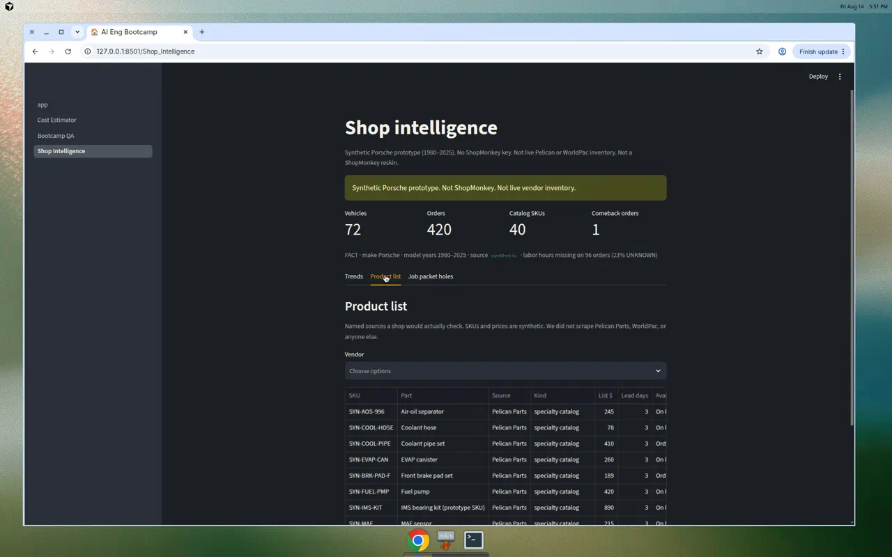
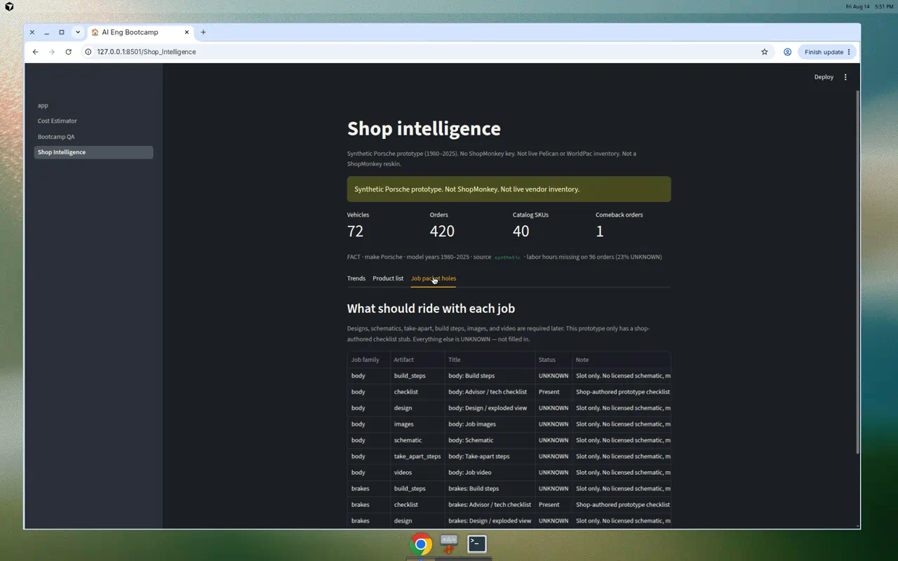

# Experiences — published paths

These are **GitHub URLs**, not local chat links. Open them in a browser.

**Branch:** `cursor/shop-intelligence-plan-11ee`  
**PR:** https://github.com/CTATX/ai-eng-bootcamp/pull/2  
**Repo:** https://github.com/CTATX/ai-eng-bootcamp

---

## This repo — three app experiences

| Experience | Local after `./start.sh` | Code | Screenshot on GitHub |
|------------|--------------------------|------|----------------------|
| Cost Estimator | http://localhost:8501/Cost_Estimator | [`pages/1_Cost_Estimator.py`](https://github.com/CTATX/ai-eng-bootcamp/blob/cursor/shop-intelligence-plan-11ee/pages/1_Cost_Estimator.py) | [PNG](https://github.com/CTATX/ai-eng-bootcamp/blob/cursor/shop-intelligence-plan-11ee/docs/examples/cost-estimator.png) |
| Bootcamp Q&A | http://localhost:8501/Bootcamp_QA | [`pages/2_Bootcamp_QA.py`](https://github.com/CTATX/ai-eng-bootcamp/blob/cursor/shop-intelligence-plan-11ee/pages/2_Bootcamp_QA.py) | [PNG](https://github.com/CTATX/ai-eng-bootcamp/blob/cursor/shop-intelligence-plan-11ee/docs/examples/bootcamp-qa.png) |
| Shop intelligence — Trends | http://localhost:8501/Shop_Intelligence | [`pages/3_Shop_Intelligence.py`](https://github.com/CTATX/ai-eng-bootcamp/blob/cursor/shop-intelligence-plan-11ee/pages/3_Shop_Intelligence.py) | [PNG](https://github.com/CTATX/ai-eng-bootcamp/blob/cursor/shop-intelligence-plan-11ee/docs/examples/shop-intel-trends.png) |
| Shop intelligence — Product list | same page, Product list tab | same | [PNG](https://github.com/CTATX/ai-eng-bootcamp/blob/cursor/shop-intelligence-plan-11ee/docs/examples/shop-intel-parts.png) |
| Shop intelligence — Job packet holes | same page, Job packet holes tab | same | [PNG](https://github.com/CTATX/ai-eng-bootcamp/blob/cursor/shop-intelligence-plan-11ee/docs/examples/shop-intel-packets.png) |

Direct image files (right-click → Open):

- https://github.com/CTATX/ai-eng-bootcamp/blob/cursor/shop-intelligence-plan-11ee/docs/examples/cost-estimator.png
- https://github.com/CTATX/ai-eng-bootcamp/blob/cursor/shop-intelligence-plan-11ee/docs/examples/bootcamp-qa.png
- https://github.com/CTATX/ai-eng-bootcamp/blob/cursor/shop-intelligence-plan-11ee/docs/examples/shop-intel-trends.png
- https://github.com/CTATX/ai-eng-bootcamp/blob/cursor/shop-intelligence-plan-11ee/docs/examples/shop-intel-parts.png
- https://github.com/CTATX/ai-eng-bootcamp/blob/cursor/shop-intelligence-plan-11ee/docs/examples/shop-intel-packets.png

Raw (always shows the picture, no GitHub chrome):

- https://raw.githubusercontent.com/CTATX/ai-eng-bootcamp/cursor/shop-intelligence-plan-11ee/docs/examples/cost-estimator.png
- https://raw.githubusercontent.com/CTATX/ai-eng-bootcamp/cursor/shop-intelligence-plan-11ee/docs/examples/bootcamp-qa.png
- https://raw.githubusercontent.com/CTATX/ai-eng-bootcamp/cursor/shop-intelligence-plan-11ee/docs/examples/shop-intel-trends.png
- https://raw.githubusercontent.com/CTATX/ai-eng-bootcamp/cursor/shop-intelligence-plan-11ee/docs/examples/shop-intel-parts.png
- https://raw.githubusercontent.com/CTATX/ai-eng-bootcamp/cursor/shop-intelligence-plan-11ee/docs/examples/shop-intel-packets.png

---

## Shop intelligence — docs

| Doc | GitHub |
|-----|--------|
| Running JTBD / requirements | https://github.com/CTATX/ai-eng-bootcamp/blob/cursor/shop-intelligence-plan-11ee/docs/shop-intelligence-jtbd.md |
| Plan (P0–P7) | https://github.com/CTATX/ai-eng-bootcamp/blob/cursor/shop-intelligence-plan-11ee/docs/shop-intelligence-plan.md |
| Briefing contract | https://github.com/CTATX/ai-eng-bootcamp/blob/cursor/shop-intelligence-plan-11ee/docs/shop-intelligence-briefing.schema.json |
| This experiences index | https://github.com/CTATX/ai-eng-bootcamp/blob/cursor/shop-intelligence-plan-11ee/docs/experiences.md |

---

## Screens (embedded — GitHub renders these)

### Cost Estimator



### Bootcamp Q&A



### Shop intelligence — Trends



### Shop intelligence — Product list



### Shop intelligence — Job packet holes



---

## Other GitHub experiences (same product OS)

| Experience | URL |
|------------|-----|
| Pull request for this work | https://github.com/CTATX/ai-eng-bootcamp/pull/2 |
| my-project home hub | https://github.com/CTATX/my-project |
| Bootcamp project index on my-project | https://github.com/CTATX/my-project/tree/main/projects/ai-eng-bootcamp |
| ai-build-crew (production cost planner) | https://github.com/CTATX/ai-build-crew |
| Cursor agent run for this thread | https://cursor.com/agents/bc-c0bbb8b2-99d0-4d96-815c-3a0d560f11ee |

---

## Run locally

```bash
./start.sh
```

Then open the Local column above. Shop intelligence does **not** need a ShopMonkey key. Q&A needs `OPENAI_API_KEY` in `.env`.
