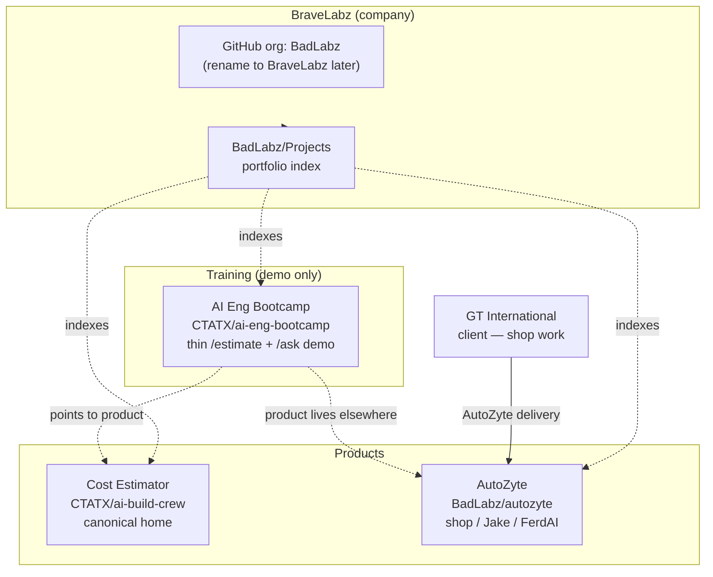

# Published experiences

## Ownership map

| Product | Home | Notes |
|---------|------|-------|
| **Cost Estimator** | [CTATX/ai-build-crew](https://github.com/CTATX/ai-build-crew) | Canonical — PM + Eng courses merge here |
| **AI Eng Bootcamp** (this repo) | [CTATX/ai-eng-bootcamp](https://github.com/CTATX/ai-eng-bootcamp) | Training demo only |
| **AutoZyte** | [BadLabz/autozyte](https://github.com/BadLabz/autozyte) | Shop / Jake — not in this repo |
| **GT International** | Client | Work *for* them — not the Cost Estimator host |
| **BraveLabz** | Your company | GitHub org still **BadLabz** until rename step |
| **BadLabz Projects** | [BadLabz/Projects](https://github.com/BadLabz/Projects) | Org portfolio index (hub), not a product runtime |

See [`cost-estimator-home.md`](cost-estimator-home.md) · [`autozyte-split.md`](autozyte-split.md).

## System map



## AI Eng Bootcamp (this repo — course demo)

| Experience | Local | Source |
|------------|-------|--------|
| Cost Estimator (demo) | http://localhost:8501/Cost_Estimator | `pages/1_Cost_Estimator.py` → thin slice of ai-build-crew |
| Bootcamp Q&A | http://localhost:8501/Bootcamp_QA | `pages/2_Bootcamp_QA.py` |

Screenshots: [`docs/examples/`](examples/)

**`/ask` spend guards (light):** `ASK_MAX_TOKENS` (default 300, hard max 500) and `ASK_MAX_USD` daily estimated ceiling (default `$1`) in `.env` — see playbook §9.

## AutoZyte (separate repo)

| Experience | Repo |
|------------|------|
| Shop intelligence, Jake Advisor, FerdAI | [BadLabz/autozyte](https://github.com/BadLabz/autozyte) · local `~/autozyte` |

## Run bootcamp demo

```bash
./start.sh
```

Q&A needs `OPENAI_API_KEY` in `.env`.

## Run Cost Estimator (product)

```bash
cd ~/ai-build-crew
pnpm install && pnpm dev
# http://localhost:3000
```

## Run AutoZyte

```bash
cd ~/autozyte
./start.sh
```
